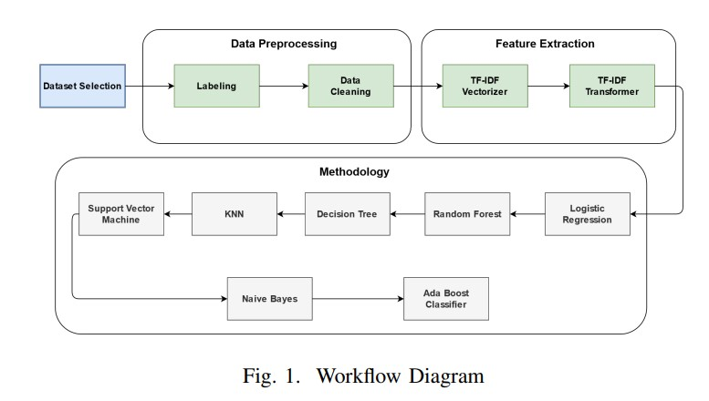
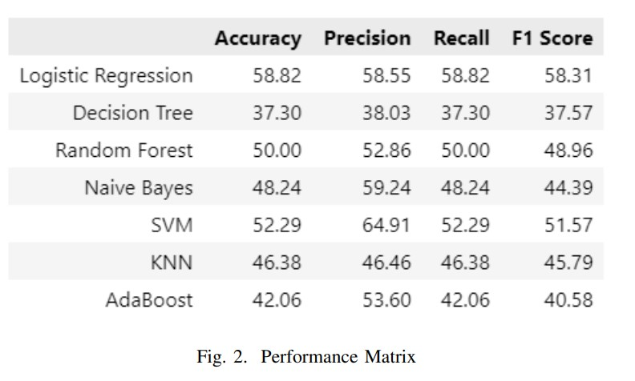
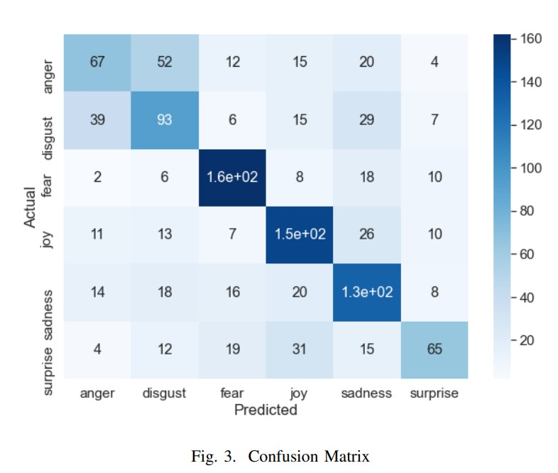

# Emotion Recognition from Bengali Text

## Project details:

- Ekman's six emotion
- Predict multiclass Emotion
- Applied multiple ML algorithms

    
<b>Workflow Diagram</b>

     

    
<b>Performance Matrix</b>

     

    
<b>Confusion Matrix</b>

     

